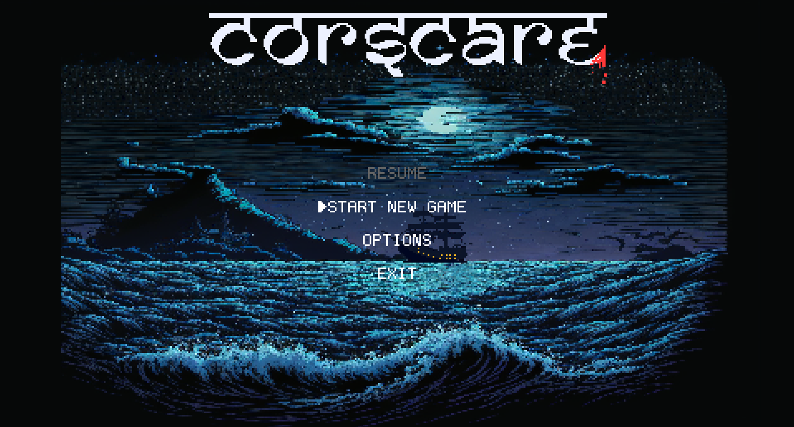
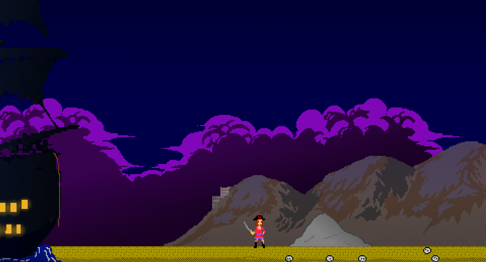
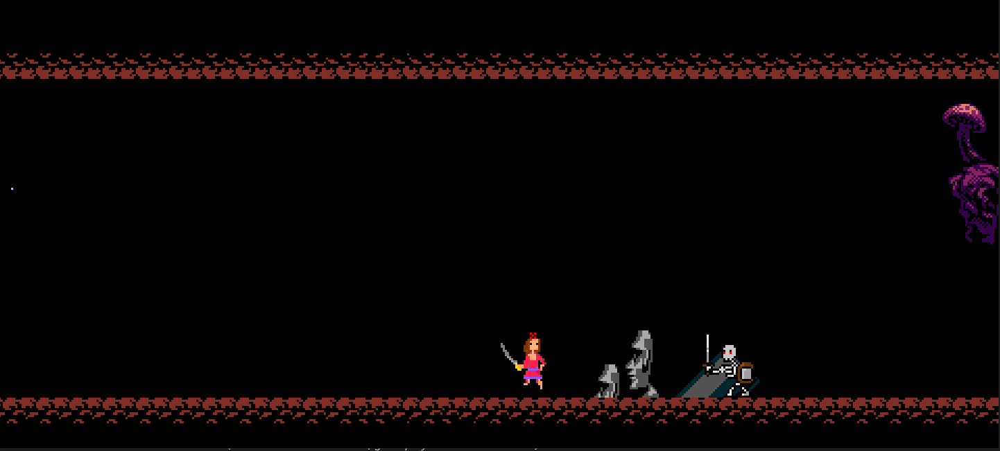

# Corscare

**CorsCare** is a 2D game built **entirely from scratch in C**, using **Windows API libraries**, **minizip** for compressed asset handling, and **XAudio2** for audio.  
The goal of this project is to demonstrate how a complete game engine and gameplay loop can be implemented in pure C without external game engines or libraries.

- **Custom 2D Rendering**: Built using raw Windows libraries for window management and graphics.  
- **Audio System**: Powered by **XAudio2** for music and sound effects.  
- **Asset Management**: Compressed resources packaged/unpacked with **minizip**.  
- **Game Loop from Scratch**: No engines or pre-made frameworks — just pure C and system libraries.  
- **Cross-Platform Design (WIP)**: Currently Windows-only, but structured for potential portability.

## Screenshots

